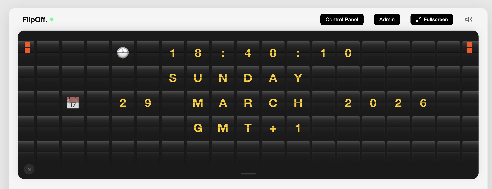

# FlipOff.

**Turn any TV into a retro split-flap display.** The classic flip-board look, without the $3,500 hardware. And it's free.



## What is this?

FlipOff is a free, open-source web app that emulates a classic mechanical split-flap (flip-board) airport terminal display — the kind you'd see at train stations and airports. It runs full-screen in any browser, turning a TV or large monitor into a beautiful retro display.

No accounts. No subscriptions. No $199 fee. Build it once and go.

## Features

- Realistic split-flap animation with mechanical character-stepping (top/bottom flap halves)
- Multiple sound modes: Authentic (default), Soft, Joke (rubber duck + fart), Mute — with stereo panning per tile
- Auto-rotating screens with shuffle and random mode
- Admin dashboard for board geometry, screens, plugins and message overrides — reachable from any device on the network
- Plugin screens: clock, current weather, 3-day forecast, GitHub stats, Quote of the Day, crypto prices
- Real-time WebSocket push — message and rotation changes appear on every connected display instantly
- Connection indicator, and automatic reconnection: a display survives a server restart without anyone touching it
- Multi-board support — run multiple independent displays from one server
- Display modes: Color, Matrix, Grayscale accent palettes
- Countdown progress bar showing time until next message (hidden in fullscreen)
- Fullscreen TV mode with automatic tile resizing
- Keyboard controls for manual navigation
- Emoji support in messages (animate through random charset characters before landing)
- Responsive from mobile to 4K displays
- Vanilla HTML/CSS/JS frontend — no UI framework, just Vite for bundling

## Running It

The display is a client of the backend — it reads its grid, charset, colours, timing and
its entire rotation from the server's `/api/config`. `web/dist` is **not** deployable on
its own; there is no static/no-server mode.

```bash
git clone https://github.com/<your-username>/flipoff.git
cd flipoff

# With Docker (recommended):
docker compose up --build

# Or without Docker (needs Node 22+):
pnpm install
pnpm build
pnpm -C backend start
```

The backend serves `web/dist`, so the frontend has to be built before it will show
anything. For development, `pnpm dev` runs Vite on http://localhost:5173 and the backend
on 8080 together, with `/api` and `/ws` proxied — run both, since `pnpm -C web dev` alone
has no server to read its config from.

| URL                                  | What                                               |
| ------------------------------------ | -------------------------------------------------- |
| `http://localhost:8080`              | Display                                            |
| `http://localhost:8080/admin`        | Admin dashboard (network-wide, password-protected) |
| `http://localhost:8080/display.html` | Standalone fullscreen display (no header/hero)     |
| `http://localhost:8080/<board-slug>` | A secondary board                                  |

The admin password is auto-generated on first run and printed to the console. Set it
explicitly with the `ADMIN_PASSWORD` environment variable.

Board config and screens persist in a Docker volume (`flipoff-data`). Message changes in
`backend/config.json` are picked up on restart for boards nobody has customised in the
admin dashboard — no need to reset the volume.

## Screens and Plugins

A board's rotation is a list of **screens**, managed in the admin dashboard. Two kinds:

- **Manual** — fixed lines you type in. A fresh install seeds these from the `messages`
  array in `backend/config.json`.
- **Plugin** — lines regenerated on a refresh interval.

| Plugin                     | Shows                                      | Needs                |
| -------------------------- | ------------------------------------------ | -------------------- |
| Date & Time                | Time, weekday, date, UTC offset            | A time zone          |
| Open-Meteo Current Weather | City, country flag, temperature, condition | A city + country     |
| Open-Meteo 3 Day Forecast  | Weekday, min/max temperature, condition    | A city + country     |
| GitHub Repo Stats          | Stars, forks, watchers                     | A repo               |
| GitHub Open Work           | Open issues and pull requests               | A repo               |
| Quote of the Day           | A daily quote                              | `API_NINJAS_API_KEY` |
| Random Quote               | A random quote                             | `API_NINJAS_API_KEY` |
| Crypto Prices              | Current prices for chosen pairs            | `API_NINJAS_API_KEY` |

A new install seeds a **clock** screen alongside the quotes. Weather is opt-in because it
needs a location: screens render on the server, so there is no per-viewer geolocation or
time zone — both are explicit settings.

Writing your own plugin is one file plus one line in the registry — see [PLUGINS.md](PLUGINS.md).

## Keyboard Shortcuts

| Key               | Action                                            |
| ----------------- | ------------------------------------------------- |
| `Enter` / `Space` | Next message                                      |
| `Arrow Left`      | Previous message                                  |
| `Arrow Right`     | Next message                                      |
| `F`               | Toggle fullscreen                                 |
| `M`               | Cycle sound mode (Authentic / Soft / Joke / Mute) |
| `R`               | Toggle random message order                       |
| `C`               | Cycle display mode (Color / Matrix / Grayscale)   |
| `Escape`          | Exit fullscreen                                   |

## How It Works

Each tile on the board is an independent split-flap element with top/bottom halves that animate through an ordered character-stepping sequence — just like a real mechanical board. Only tiles whose content changes between messages animate. Emojis are supported: tiles flip through random charset characters before snapping to the final emoji.

Sound is generated per-tile using extracted tick slices from a recorded split-flap audio clip, with stereo panning based on tile position. A master audio chain applies lowpass filtering, EQ, and compression across four sound profiles. Authentic mode is the default.

The browser holds no configuration of its own. `constants.js` blocks on `/api/config` at
startup and retries until the server answers, so a display started before the backend
simply waits and then comes up. After that, the server pushes `message_state` and
`config_state` frames over `/ws`; content changes swap the rotation in place, and only a
layout change — grid, charset, palette, animation timing — reloads the page.

## File Structure

A pnpm workspace with two packages: `web` (frontend) and `backend` (server).

```
flipoff/
  pnpm-workspace.yaml     — Workspace definition
  Dockerfile              — Container image (builds web, runs the backend)
  docker-compose.yml      — Docker Compose with persistent volume
  PLUGINS.md              — Plugin development guide
  web/
    index.html            — Main display page
    display.html          — Standalone fullscreen display (no chrome)
    admin.html            — Admin dashboard
    vite.config.ts        — Build config: 3 entry pages, dev proxy to the backend
    public/
      images/             — Screenshot and other static images
    src/
      main.js             — Entry point, audio init, fullscreen, remote sync
      Board.js            — Tile grid, display modes, transitions
      Tile.js             — Split-flap flip with character stepping and emoji support
      SoundEngine.js      — Sound profiles, tick extraction, stereo panning
      MessageRotator.js   — Shuffle, random mode, remote override
      KeyboardController.js — Keyboard shortcuts (F, M, R, C, arrows, etc.)
      RemoteMessageSync.js — WebSocket sync and reconnection
      admin.js            — Admin dashboard UI
      constants.js        — Fetches /api/config and exports it as module constants
      flapAudio.js        — Embedded base64 audio clip
      audio/              — Joke mode: rubber duck squeak, fart finisher
      css/
        reset.css         — CSS reset
        layout.css        — Page layout, nav buttons, countdown bar, fullscreen
        board.css         — Board container, accent bars, shortcuts overlay
        tile.css          — Split-flap tile halves and flip animations
        responsive.css    — Media queries (mobile through 4K)
        admin.css         — Admin dashboard styles
  backend/
    config.json           — Grid, timing, charset, colors, seed messages
    src/
      main.ts             — Entry point, http server, WebSocket upgrade
      app.ts              — Express app: middleware, routes, static serving
      types.ts            — Shared state and screen types
      config/             — Data paths and config.json-derived defaults
      board/              — Board config, screens, registry, validation
      auth/               — bcrypt password handling and admin sessions
      ws/                 — WebSocket hub and per-board broadcast
      routes/             — pages, /api, /api/admin
      middleware/         — Cache headers
      plugins/
        base.ts           — Plugin types, manifests, schema validation
        index.ts          — Plugin registry (add new plugins here)
        runtime.ts        — Refresh loops and error handling
        datetime/         — Clock
        weather/          — Open-Meteo current conditions and 3-day forecast
        github/           — Repo stats, open issues/PRs
        api-ninjas/       — Quote of the Day, random quotes, crypto prices
```

## Customization

Most of what you'll want to change lives in the **admin dashboard**: board size, message
duration, and the screens themselves. Those persist to `~/.flipoff` and take effect
immediately.

The rest is in `backend/config.json`, read once at server startup and served to the
display through `/api/config`:

- **Messages**: the 5-line arrays a brand-new board is seeded with
- **Grid size**: `grid.cols` and `grid.rows`
- **Timing**: `timing.flipStepDuration`, `timing.staggerDelay`, `timing.messageInterval`, etc.
- **Colors**: `accentColors` array
- **Character set**: `charset` string (A-Z, 0-9, punctuation, parentheses). This drives the
  flip animation rather than filtering text — characters outside it, emoji included, still
  render.

Message changes take effect on restart for any board whose screens you haven't edited in
the admin dashboard — no need to reset Docker volumes or clear state. Once you customise a
board's screens, they win and `config.json` stops overriding them.

Set `FLIPOFF_CONFIG_PATH` to read that file from somewhere else, so a container can
bind-mount its own without rebuilding the image.

## Environment Variables (backend)

| Variable              | Default               | Description                                |
| --------------------- | --------------------- | ------------------------------------------ |
| `PORT`                | `8080`                | Server listen port                         |
| `ADMIN_PASSWORD`      | Auto-generated        | Admin dashboard password                   |
| `API_NINJAS_API_KEY`  | —                     | API key for quote and crypto price plugins |
| `FLIPOFF_CONFIG_PATH` | `backend/config.json` | Grid, timing, charset, colors and seed messages |
| `FLIPOFF_DATA_DIR`    | `~/.flipoff`          | Where board settings and screens persist   |

## License

MIT — do whatever you want with it.
